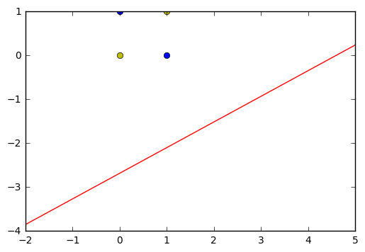

```python
#51CTO课程频道：http://edu.51cto.com/lecturer/index/user_id-12330098.html
#优酷频道：http://i.youku.com/sdxxqbf
#Github：https://github.com/Qinbf
```


```python
'''
异或
0^0 = 0
0^1 = 1
1^0 = 1
1^1 = 0
'''
```


    '\n异或\n0^0 = 0\n0^1 = 1\n1^0 = 1\n1^1 = 0\n'


```python
import numpy as np
import matplotlib.pyplot as plt
```


```python
#输入数据
X = np.array([[1,0,0],
              [1,0,1],
              [1,1,0],
              [1,1,1]])
#标签
Y = np.array([-1,1,1,-1])
#权值初始化，1行3列，取值范围-1到1
W = (np.random.random(3)-0.5)*2
print(W)
#学习率设置
lr = 0.11
#计算迭代次数
n = 0
#神经网络输出
O = 0

def update():
    global X,Y,W,lr,n
    n+=1
    O = np.sign(np.dot(X,W.T))
    W_C = lr*((Y-O.T).dot(X))/int(X.shape[0])
    W = W + W_C
```

    [-0.08535332 -0.84234456 -0.74029992]
    


```python
for _ in range(1000):
    update()#更新权值
    print(W)#打印当前权值
    print(n)#打印迭代次数
    O = np.sign(np.dot(X,W.T))#计算当前输出
    if(O == Y.T).all(): #如果实际输出等于期望输出，模型收敛，循环结束
        print('Finished')
        print('epoch:',n)
        break

#正样本
x1 = [0,1]
y1 = [1,0]
#负样本
x2 = [0,1]
y2 = [0,1]

#计算分界线的斜率以及截距
k = -W[1]/W[2]
d = -W[0]/W[2]
print('k=',k)
print('d=',d)

xdata = np.linspace(-2,5)

plt.figure()
plt.plot(xdata,xdata*k+d,'r')
plt.plot(x1,y1,'bo')
plt.plot(x2,y2,'yo')
plt.show()
```

    [ 0.02464668 -0.78734456 -0.68529992]
    1
    [ 0.07964668 -0.73234456 -0.63029992]
    2
    [ 0.13464668 -0.67734456 -0.57529992]
    3
    [ 0.18964668 -0.62234456 -0.52029992]
    4
    [ 0.24464668 -0.56734456 -0.46529992]
    5
    [ 0.29964668 -0.51234456 -0.41029992]
    6
    [ 0.35464668 -0.45734456 -0.35529992]
    7
    [ 0.40964668 -0.40234456 -0.30029992]
    8
    [ 0.35464668 -0.40234456 -0.30029992]
    9
    [ 0.35464668 -0.34734456 -0.30029992]
    10
    [ 0.29964668 -0.34734456 -0.30029992]
    11
    [ 0.35464668 -0.29234456 -0.24529992]
    12
    [ 0.29964668 -0.29234456 -0.24529992]
    13
    [ 0.24464668 -0.29234456 -0.24529992]
    14
    [ 0.29964668 -0.23734456 -0.19029992]
    15
    [ 0.24464668 -0.23734456 -0.19029992]
    16
    [ 0.18964668 -0.23734456 -0.19029992]
    17
    [ 0.24464668 -0.18234456 -0.13529992]
    18
    [ 0.18964668 -0.18234456 -0.13529992]
    19
    [ 0.13464668 -0.18234456 -0.13529992]
    20
    [ 0.18964668 -0.12734456 -0.08029992]
    21
    [ 0.13464668 -0.12734456 -0.08029992]
    22
    [ 0.07964668 -0.12734456 -0.08029992]
    23
    [ 0.13464668 -0.07234456 -0.02529992]
    24
    [ 0.02464668 -0.12734456 -0.08029992]
    25
    [ 0.07964668 -0.07234456 -0.02529992]
    26
    [ 0.02464668 -0.07234456 -0.02529992]
    27
    [ 0.07964668 -0.01734456  0.02970008]
    28
    [-0.03035332 -0.07234456 -0.02529992]
    29
    [ 0.07964668 -0.01734456  0.02970008]
    30
    [-0.03035332 -0.07234456 -0.02529992]
    31
    [ 0.07964668 -0.01734456  0.02970008]
    32
    [-0.03035332 -0.07234456 -0.02529992]
    33
    [ 0.07964668 -0.01734456  0.02970008]
    34
    [-0.03035332 -0.07234456 -0.02529992]
    35
    [ 0.07964668 -0.01734456  0.02970008]
    36
    [-0.03035332 -0.07234456 -0.02529992]
    37
    [ 0.07964668 -0.01734456  0.02970008]
    38
    [-0.03035332 -0.07234456 -0.02529992]
    39
    [ 0.07964668 -0.01734456  0.02970008]
    40
    [-0.03035332 -0.07234456 -0.02529992]
    41
    [ 0.07964668 -0.01734456  0.02970008]
    42
    [-0.03035332 -0.07234456 -0.02529992]
    43
    [ 0.07964668 -0.01734456  0.02970008]
    44
    [-0.03035332 -0.07234456 -0.02529992]
    45
    [ 0.07964668 -0.01734456  0.02970008]
    46
    [-0.03035332 -0.07234456 -0.02529992]
    47
    [ 0.07964668 -0.01734456  0.02970008]
    48
    [-0.03035332 -0.07234456 -0.02529992]
    49
    [ 0.07964668 -0.01734456  0.02970008]
    50
    [-0.03035332 -0.07234456 -0.02529992]
    51
    [ 0.07964668 -0.01734456  0.02970008]
    52
    [-0.03035332 -0.07234456 -0.02529992]
    53
    [ 0.07964668 -0.01734456  0.02970008]
    54
    [-0.03035332 -0.07234456 -0.02529992]
    55
    [ 0.07964668 -0.01734456  0.02970008]
    56
    [-0.03035332 -0.07234456 -0.02529992]
    57
    [ 0.07964668 -0.01734456  0.02970008]
    58
    [-0.03035332 -0.07234456 -0.02529992]
    59
    [ 0.07964668 -0.01734456  0.02970008]
    60
    [-0.03035332 -0.07234456 -0.02529992]
    61
    [ 0.07964668 -0.01734456  0.02970008]
    62
    [-0.03035332 -0.07234456 -0.02529992]
    63
    [ 0.07964668 -0.01734456  0.02970008]
    64
    [-0.03035332 -0.07234456 -0.02529992]
    65
    [ 0.07964668 -0.01734456  0.02970008]
    66
    [-0.03035332 -0.07234456 -0.02529992]
    67
    [ 0.07964668 -0.01734456  0.02970008]
    68
    [-0.03035332 -0.07234456 -0.02529992]
    69
    [ 0.07964668 -0.01734456  0.02970008]
    70
    [-0.03035332 -0.07234456 -0.02529992]
    71
    [ 0.07964668 -0.01734456  0.02970008]
    72
    [-0.03035332 -0.07234456 -0.02529992]
    73
    [ 0.07964668 -0.01734456  0.02970008]
    74
    [-0.03035332 -0.07234456 -0.02529992]
    75
    [ 0.07964668 -0.01734456  0.02970008]
    76
    [-0.03035332 -0.07234456 -0.02529992]
    77
    [ 0.07964668 -0.01734456  0.02970008]
    78
    [-0.03035332 -0.07234456 -0.02529992]
    79
    [ 0.07964668 -0.01734456  0.02970008]
    80
    [-0.03035332 -0.07234456 -0.02529992]
    81
    [ 0.07964668 -0.01734456  0.02970008]
    82
    [-0.03035332 -0.07234456 -0.02529992]
    83
    [ 0.07964668 -0.01734456  0.02970008]
    84
    [-0.03035332 -0.07234456 -0.02529992]
    85
    [ 0.07964668 -0.01734456  0.02970008]
    86
    [-0.03035332 -0.07234456 -0.02529992]
    87
    [ 0.07964668 -0.01734456  0.02970008]
    88
    [-0.03035332 -0.07234456 -0.02529992]
    89
    [ 0.07964668 -0.01734456  0.02970008]
    90
    [-0.03035332 -0.07234456 -0.02529992]
    91
    [ 0.07964668 -0.01734456  0.02970008]
    92
    [-0.03035332 -0.07234456 -0.02529992]
    93
    [ 0.07964668 -0.01734456  0.02970008]
    94
    [-0.03035332 -0.07234456 -0.02529992]
    95
    [ 0.07964668 -0.01734456  0.02970008]
    96
    [-0.03035332 -0.07234456 -0.02529992]
    97
    [ 0.07964668 -0.01734456  0.02970008]
    98
    [-0.03035332 -0.07234456 -0.02529992]
    99
    [ 0.07964668 -0.01734456  0.02970008]
    100
    [-0.03035332 -0.07234456 -0.02529992]
    101
    [ 0.07964668 -0.01734456  0.02970008]
    102
    [-0.03035332 -0.07234456 -0.02529992]
    103
    [ 0.07964668 -0.01734456  0.02970008]
    104
    [-0.03035332 -0.07234456 -0.02529992]
    105
    [ 0.07964668 -0.01734456  0.02970008]
    106
    [-0.03035332 -0.07234456 -0.02529992]
    107
    [ 0.07964668 -0.01734456  0.02970008]
    108
    [-0.03035332 -0.07234456 -0.02529992]
    109
    [ 0.07964668 -0.01734456  0.02970008]
    110
    [-0.03035332 -0.07234456 -0.02529992]
    111
    [ 0.07964668 -0.01734456  0.02970008]
    112
    [-0.03035332 -0.07234456 -0.02529992]
    113
    [ 0.07964668 -0.01734456  0.02970008]
    114
    [-0.03035332 -0.07234456 -0.02529992]
    115
    [ 0.07964668 -0.01734456  0.02970008]
    116
    [-0.03035332 -0.07234456 -0.02529992]
    117
    [ 0.07964668 -0.01734456  0.02970008]
    118
    [-0.03035332 -0.07234456 -0.02529992]
    119
    [ 0.07964668 -0.01734456  0.02970008]
    120
    [-0.03035332 -0.07234456 -0.02529992]
    121
    [ 0.07964668 -0.01734456  0.02970008]
    122
    [-0.03035332 -0.07234456 -0.02529992]
    123
    [ 0.07964668 -0.01734456  0.02970008]
    124
    [-0.03035332 -0.07234456 -0.02529992]
    125
    [ 0.07964668 -0.01734456  0.02970008]
    126
    [-0.03035332 -0.07234456 -0.02529992]
    127
    [ 0.07964668 -0.01734456  0.02970008]
    128
    [-0.03035332 -0.07234456 -0.02529992]
    129
    [ 0.07964668 -0.01734456  0.02970008]
    130
    [-0.03035332 -0.07234456 -0.02529992]
    131
    [ 0.07964668 -0.01734456  0.02970008]
    132
    [-0.03035332 -0.07234456 -0.02529992]
    133
    [ 0.07964668 -0.01734456  0.02970008]
    134
    [-0.03035332 -0.07234456 -0.02529992]
    135
    [ 0.07964668 -0.01734456  0.02970008]
    136
    [-0.03035332 -0.07234456 -0.02529992]
    137
    [ 0.07964668 -0.01734456  0.02970008]
    138
    [-0.03035332 -0.07234456 -0.02529992]
    139
    [ 0.07964668 -0.01734456  0.02970008]
    140
    [-0.03035332 -0.07234456 -0.02529992]
    141
    [ 0.07964668 -0.01734456  0.02970008]
    142
    [-0.03035332 -0.07234456 -0.02529992]
    143
    [ 0.07964668 -0.01734456  0.02970008]
    144
    [-0.03035332 -0.07234456 -0.02529992]
    145
    [ 0.07964668 -0.01734456  0.02970008]
    146
    [-0.03035332 -0.07234456 -0.02529992]
    147
    [ 0.07964668 -0.01734456  0.02970008]
    148
    [-0.03035332 -0.07234456 -0.02529992]
    149
    [ 0.07964668 -0.01734456  0.02970008]
    150
    [-0.03035332 -0.07234456 -0.02529992]
    151
    [ 0.07964668 -0.01734456  0.02970008]
    152
    [-0.03035332 -0.07234456 -0.02529992]
    153
    [ 0.07964668 -0.01734456  0.02970008]
    154
    [-0.03035332 -0.07234456 -0.02529992]
    155
    [ 0.07964668 -0.01734456  0.02970008]
    156
    [-0.03035332 -0.07234456 -0.02529992]
    157
    [ 0.07964668 -0.01734456  0.02970008]
    158
    [-0.03035332 -0.07234456 -0.02529992]
    159
    [ 0.07964668 -0.01734456  0.02970008]
    160
    [-0.03035332 -0.07234456 -0.02529992]
    161
    [ 0.07964668 -0.01734456  0.02970008]
    162
    [-0.03035332 -0.07234456 -0.02529992]
    163
    [ 0.07964668 -0.01734456  0.02970008]
    164
    [-0.03035332 -0.07234456 -0.02529992]
    165
    [ 0.07964668 -0.01734456  0.02970008]
    166
    [-0.03035332 -0.07234456 -0.02529992]
    167
    [ 0.07964668 -0.01734456  0.02970008]
    168
    [-0.03035332 -0.07234456 -0.02529992]
    169
    [ 0.07964668 -0.01734456  0.02970008]
    170
    [-0.03035332 -0.07234456 -0.02529992]
    171
    [ 0.07964668 -0.01734456  0.02970008]
    172
    [-0.03035332 -0.07234456 -0.02529992]
    173
    [ 0.07964668 -0.01734456  0.02970008]
    174
    [-0.03035332 -0.07234456 -0.02529992]
    175
    [ 0.07964668 -0.01734456  0.02970008]
    176
    [-0.03035332 -0.07234456 -0.02529992]
    177
    [ 0.07964668 -0.01734456  0.02970008]
    178
    [-0.03035332 -0.07234456 -0.02529992]
    179
    [ 0.07964668 -0.01734456  0.02970008]
    180
    [-0.03035332 -0.07234456 -0.02529992]
    181
    [ 0.07964668 -0.01734456  0.02970008]
    182
    [-0.03035332 -0.07234456 -0.02529992]
    183
    [ 0.07964668 -0.01734456  0.02970008]
    184
    [-0.03035332 -0.07234456 -0.02529992]
    185
    [ 0.07964668 -0.01734456  0.02970008]
    186
    [-0.03035332 -0.07234456 -0.02529992]
    187
    [ 0.07964668 -0.01734456  0.02970008]
    188
    [-0.03035332 -0.07234456 -0.02529992]
    189
    [ 0.07964668 -0.01734456  0.02970008]
    190
    [-0.03035332 -0.07234456 -0.02529992]
    191
    [ 0.07964668 -0.01734456  0.02970008]
    192
    [-0.03035332 -0.07234456 -0.02529992]
    193
    [ 0.07964668 -0.01734456  0.02970008]
    194
    [-0.03035332 -0.07234456 -0.02529992]
    195
    [ 0.07964668 -0.01734456  0.02970008]
    196
    [-0.03035332 -0.07234456 -0.02529992]
    197
    [ 0.07964668 -0.01734456  0.02970008]
    198
    [-0.03035332 -0.07234456 -0.02529992]
    199
    [ 0.07964668 -0.01734456  0.02970008]
    200
    [-0.03035332 -0.07234456 -0.02529992]
    201
    [ 0.07964668 -0.01734456  0.02970008]
    202
    [-0.03035332 -0.07234456 -0.02529992]
    203
    [ 0.07964668 -0.01734456  0.02970008]
    204
    [-0.03035332 -0.07234456 -0.02529992]
    205
    [ 0.07964668 -0.01734456  0.02970008]
    206
    [-0.03035332 -0.07234456 -0.02529992]
    207
    [ 0.07964668 -0.01734456  0.02970008]
    208
    [-0.03035332 -0.07234456 -0.02529992]
    209
    [ 0.07964668 -0.01734456  0.02970008]
    210
    [-0.03035332 -0.07234456 -0.02529992]
    211
    [ 0.07964668 -0.01734456  0.02970008]
    212
    [-0.03035332 -0.07234456 -0.02529992]
    213
    [ 0.07964668 -0.01734456  0.02970008]
    214
    [-0.03035332 -0.07234456 -0.02529992]
    215
    [ 0.07964668 -0.01734456  0.02970008]
    216
    [-0.03035332 -0.07234456 -0.02529992]
    217
    [ 0.07964668 -0.01734456  0.02970008]
    218
    [-0.03035332 -0.07234456 -0.02529992]
    219
    [ 0.07964668 -0.01734456  0.02970008]
    220
    [-0.03035332 -0.07234456 -0.02529992]
    221
    [ 0.07964668 -0.01734456  0.02970008]
    222
    [-0.03035332 -0.07234456 -0.02529992]
    223
    [ 0.07964668 -0.01734456  0.02970008]
    224
    [-0.03035332 -0.07234456 -0.02529992]
    225
    [ 0.07964668 -0.01734456  0.02970008]
    226
    [-0.03035332 -0.07234456 -0.02529992]
    227
    [ 0.07964668 -0.01734456  0.02970008]
    228
    [-0.03035332 -0.07234456 -0.02529992]
    229
    [ 0.07964668 -0.01734456  0.02970008]
    230
    [-0.03035332 -0.07234456 -0.02529992]
    231
    [ 0.07964668 -0.01734456  0.02970008]
    232
    [-0.03035332 -0.07234456 -0.02529992]
    233
    [ 0.07964668 -0.01734456  0.02970008]
    234
    [-0.03035332 -0.07234456 -0.02529992]
    235
    [ 0.07964668 -0.01734456  0.02970008]
    236
    [-0.03035332 -0.07234456 -0.02529992]
    237
    [ 0.07964668 -0.01734456  0.02970008]
    238
    [-0.03035332 -0.07234456 -0.02529992]
    239
    [ 0.07964668 -0.01734456  0.02970008]
    240
    [-0.03035332 -0.07234456 -0.02529992]
    241
    [ 0.07964668 -0.01734456  0.02970008]
    242
    [-0.03035332 -0.07234456 -0.02529992]
    243
    [ 0.07964668 -0.01734456  0.02970008]
    244
    [-0.03035332 -0.07234456 -0.02529992]
    245
    [ 0.07964668 -0.01734456  0.02970008]
    246
    [-0.03035332 -0.07234456 -0.02529992]
    247
    [ 0.07964668 -0.01734456  0.02970008]
    248
    [-0.03035332 -0.07234456 -0.02529992]
    249
    [ 0.07964668 -0.01734456  0.02970008]
    250
    [-0.03035332 -0.07234456 -0.02529992]
    251
    [ 0.07964668 -0.01734456  0.02970008]
    252
    [-0.03035332 -0.07234456 -0.02529992]
    253
    [ 0.07964668 -0.01734456  0.02970008]
    254
    [-0.03035332 -0.07234456 -0.02529992]
    255
    [ 0.07964668 -0.01734456  0.02970008]
    256
    [-0.03035332 -0.07234456 -0.02529992]
    257
    [ 0.07964668 -0.01734456  0.02970008]
    258
    [-0.03035332 -0.07234456 -0.02529992]
    259
    [ 0.07964668 -0.01734456  0.02970008]
    260
    [-0.03035332 -0.07234456 -0.02529992]
    261
    [ 0.07964668 -0.01734456  0.02970008]
    262
    [-0.03035332 -0.07234456 -0.02529992]
    263
    [ 0.07964668 -0.01734456  0.02970008]
    264
    [-0.03035332 -0.07234456 -0.02529992]
    265
    [ 0.07964668 -0.01734456  0.02970008]
    266
    [-0.03035332 -0.07234456 -0.02529992]
    267
    [ 0.07964668 -0.01734456  0.02970008]
    268
    [-0.03035332 -0.07234456 -0.02529992]
    269
    [ 0.07964668 -0.01734456  0.02970008]
    270
    [-0.03035332 -0.07234456 -0.02529992]
    271
    [ 0.07964668 -0.01734456  0.02970008]
    272
    [-0.03035332 -0.07234456 -0.02529992]
    273
    [ 0.07964668 -0.01734456  0.02970008]
    274
    [-0.03035332 -0.07234456 -0.02529992]
    275
    [ 0.07964668 -0.01734456  0.02970008]
    276
    [-0.03035332 -0.07234456 -0.02529992]
    277
    [ 0.07964668 -0.01734456  0.02970008]
    278
    [-0.03035332 -0.07234456 -0.02529992]
    279
    [ 0.07964668 -0.01734456  0.02970008]
    280
    [-0.03035332 -0.07234456 -0.02529992]
    281
    [ 0.07964668 -0.01734456  0.02970008]
    282
    [-0.03035332 -0.07234456 -0.02529992]
    283
    [ 0.07964668 -0.01734456  0.02970008]
    284
    [-0.03035332 -0.07234456 -0.02529992]
    285
    [ 0.07964668 -0.01734456  0.02970008]
    286
    [-0.03035332 -0.07234456 -0.02529992]
    287
    [ 0.07964668 -0.01734456  0.02970008]
    288
    [-0.03035332 -0.07234456 -0.02529992]
    289
    [ 0.07964668 -0.01734456  0.02970008]
    290
    [-0.03035332 -0.07234456 -0.02529992]
    291
    [ 0.07964668 -0.01734456  0.02970008]
    292
    [-0.03035332 -0.07234456 -0.02529992]
    293
    [ 0.07964668 -0.01734456  0.02970008]
    294
    [-0.03035332 -0.07234456 -0.02529992]
    295
    [ 0.07964668 -0.01734456  0.02970008]
    296
    [-0.03035332 -0.07234456 -0.02529992]
    297
    [ 0.07964668 -0.01734456  0.02970008]
    298
    [-0.03035332 -0.07234456 -0.02529992]
    299
    [ 0.07964668 -0.01734456  0.02970008]
    300
    [-0.03035332 -0.07234456 -0.02529992]
    301
    [ 0.07964668 -0.01734456  0.02970008]
    302
    [-0.03035332 -0.07234456 -0.02529992]
    303
    [ 0.07964668 -0.01734456  0.02970008]
    304
    [-0.03035332 -0.07234456 -0.02529992]
    305
    [ 0.07964668 -0.01734456  0.02970008]
    306
    [-0.03035332 -0.07234456 -0.02529992]
    307
    [ 0.07964668 -0.01734456  0.02970008]
    308
    [-0.03035332 -0.07234456 -0.02529992]
    309
    [ 0.07964668 -0.01734456  0.02970008]
    310
    [-0.03035332 -0.07234456 -0.02529992]
    311
    [ 0.07964668 -0.01734456  0.02970008]
    312
    [-0.03035332 -0.07234456 -0.02529992]
    313
    [ 0.07964668 -0.01734456  0.02970008]
    314
    [-0.03035332 -0.07234456 -0.02529992]
    315
    [ 0.07964668 -0.01734456  0.02970008]
    316
    [-0.03035332 -0.07234456 -0.02529992]
    317
    [ 0.07964668 -0.01734456  0.02970008]
    318
    [-0.03035332 -0.07234456 -0.02529992]
    319
    [ 0.07964668 -0.01734456  0.02970008]
    320
    [-0.03035332 -0.07234456 -0.02529992]
    321
    [ 0.07964668 -0.01734456  0.02970008]
    322
    [-0.03035332 -0.07234456 -0.02529992]
    323
    [ 0.07964668 -0.01734456  0.02970008]
    324
    [-0.03035332 -0.07234456 -0.02529992]
    325
    [ 0.07964668 -0.01734456  0.02970008]
    326
    [-0.03035332 -0.07234456 -0.02529992]
    327
    [ 0.07964668 -0.01734456  0.02970008]
    328
    [-0.03035332 -0.07234456 -0.02529992]
    329
    [ 0.07964668 -0.01734456  0.02970008]
    330
    [-0.03035332 -0.07234456 -0.02529992]
    331
    [ 0.07964668 -0.01734456  0.02970008]
    332
    [-0.03035332 -0.07234456 -0.02529992]
    333
    [ 0.07964668 -0.01734456  0.02970008]
    334
    [-0.03035332 -0.07234456 -0.02529992]
    335
    [ 0.07964668 -0.01734456  0.02970008]
    336
    [-0.03035332 -0.07234456 -0.02529992]
    337
    [ 0.07964668 -0.01734456  0.02970008]
    338
    [-0.03035332 -0.07234456 -0.02529992]
    339
    [ 0.07964668 -0.01734456  0.02970008]
    340
    [-0.03035332 -0.07234456 -0.02529992]
    341
    [ 0.07964668 -0.01734456  0.02970008]
    342
    [-0.03035332 -0.07234456 -0.02529992]
    343
    [ 0.07964668 -0.01734456  0.02970008]
    344
    [-0.03035332 -0.07234456 -0.02529992]
    345
    [ 0.07964668 -0.01734456  0.02970008]
    346
    [-0.03035332 -0.07234456 -0.02529992]
    347
    [ 0.07964668 -0.01734456  0.02970008]
    348
    [-0.03035332 -0.07234456 -0.02529992]
    349
    [ 0.07964668 -0.01734456  0.02970008]
    350
    [-0.03035332 -0.07234456 -0.02529992]
    351
    [ 0.07964668 -0.01734456  0.02970008]
    352
    [-0.03035332 -0.07234456 -0.02529992]
    353
    [ 0.07964668 -0.01734456  0.02970008]
    354
    [-0.03035332 -0.07234456 -0.02529992]
    355
    [ 0.07964668 -0.01734456  0.02970008]
    356
    [-0.03035332 -0.07234456 -0.02529992]
    357
    [ 0.07964668 -0.01734456  0.02970008]
    358
    [-0.03035332 -0.07234456 -0.02529992]
    359
    [ 0.07964668 -0.01734456  0.02970008]
    360
    [-0.03035332 -0.07234456 -0.02529992]
    361
    [ 0.07964668 -0.01734456  0.02970008]
    362
    [-0.03035332 -0.07234456 -0.02529992]
    363
    [ 0.07964668 -0.01734456  0.02970008]
    364
    [-0.03035332 -0.07234456 -0.02529992]
    365
    [ 0.07964668 -0.01734456  0.02970008]
    366
    [-0.03035332 -0.07234456 -0.02529992]
    367
    [ 0.07964668 -0.01734456  0.02970008]
    368
    [-0.03035332 -0.07234456 -0.02529992]
    369
    [ 0.07964668 -0.01734456  0.02970008]
    370
    [-0.03035332 -0.07234456 -0.02529992]
    371
    [ 0.07964668 -0.01734456  0.02970008]
    372
    [-0.03035332 -0.07234456 -0.02529992]
    373
    [ 0.07964668 -0.01734456  0.02970008]
    374
    [-0.03035332 -0.07234456 -0.02529992]
    375
    [ 0.07964668 -0.01734456  0.02970008]
    376
    [-0.03035332 -0.07234456 -0.02529992]
    377
    [ 0.07964668 -0.01734456  0.02970008]
    378
    [-0.03035332 -0.07234456 -0.02529992]
    379
    [ 0.07964668 -0.01734456  0.02970008]
    380
    [-0.03035332 -0.07234456 -0.02529992]
    381
    [ 0.07964668 -0.01734456  0.02970008]
    382
    [-0.03035332 -0.07234456 -0.02529992]
    383
    [ 0.07964668 -0.01734456  0.02970008]
    384
    [-0.03035332 -0.07234456 -0.02529992]
    385
    [ 0.07964668 -0.01734456  0.02970008]
    386
    [-0.03035332 -0.07234456 -0.02529992]
    387
    [ 0.07964668 -0.01734456  0.02970008]
    388
    [-0.03035332 -0.07234456 -0.02529992]
    389
    [ 0.07964668 -0.01734456  0.02970008]
    390
    [-0.03035332 -0.07234456 -0.02529992]
    391
    [ 0.07964668 -0.01734456  0.02970008]
    392
    [-0.03035332 -0.07234456 -0.02529992]
    393
    [ 0.07964668 -0.01734456  0.02970008]
    394
    [-0.03035332 -0.07234456 -0.02529992]
    395
    [ 0.07964668 -0.01734456  0.02970008]
    396
    [-0.03035332 -0.07234456 -0.02529992]
    397
    [ 0.07964668 -0.01734456  0.02970008]
    398
    [-0.03035332 -0.07234456 -0.02529992]
    399
    [ 0.07964668 -0.01734456  0.02970008]
    400
    [-0.03035332 -0.07234456 -0.02529992]
    401
    [ 0.07964668 -0.01734456  0.02970008]
    402
    [-0.03035332 -0.07234456 -0.02529992]
    403
    [ 0.07964668 -0.01734456  0.02970008]
    404
    [-0.03035332 -0.07234456 -0.02529992]
    405
    [ 0.07964668 -0.01734456  0.02970008]
    406
    [-0.03035332 -0.07234456 -0.02529992]
    407
    [ 0.07964668 -0.01734456  0.02970008]
    408
    [-0.03035332 -0.07234456 -0.02529992]
    409
    [ 0.07964668 -0.01734456  0.02970008]
    410
    [-0.03035332 -0.07234456 -0.02529992]
    411
    [ 0.07964668 -0.01734456  0.02970008]
    412
    [-0.03035332 -0.07234456 -0.02529992]
    413
    [ 0.07964668 -0.01734456  0.02970008]
    414
    [-0.03035332 -0.07234456 -0.02529992]
    415
    [ 0.07964668 -0.01734456  0.02970008]
    416
    [-0.03035332 -0.07234456 -0.02529992]
    417
    [ 0.07964668 -0.01734456  0.02970008]
    418
    [-0.03035332 -0.07234456 -0.02529992]
    419
    [ 0.07964668 -0.01734456  0.02970008]
    420
    [-0.03035332 -0.07234456 -0.02529992]
    421
    [ 0.07964668 -0.01734456  0.02970008]
    422
    [-0.03035332 -0.07234456 -0.02529992]
    423
    [ 0.07964668 -0.01734456  0.02970008]
    424
    [-0.03035332 -0.07234456 -0.02529992]
    425
    [ 0.07964668 -0.01734456  0.02970008]
    426
    [-0.03035332 -0.07234456 -0.02529992]
    427
    [ 0.07964668 -0.01734456  0.02970008]
    428
    [-0.03035332 -0.07234456 -0.02529992]
    429
    [ 0.07964668 -0.01734456  0.02970008]
    430
    [-0.03035332 -0.07234456 -0.02529992]
    431
    [ 0.07964668 -0.01734456  0.02970008]
    432
    [-0.03035332 -0.07234456 -0.02529992]
    433
    [ 0.07964668 -0.01734456  0.02970008]
    434
    [-0.03035332 -0.07234456 -0.02529992]
    435
    [ 0.07964668 -0.01734456  0.02970008]
    436
    [-0.03035332 -0.07234456 -0.02529992]
    437
    [ 0.07964668 -0.01734456  0.02970008]
    438
    [-0.03035332 -0.07234456 -0.02529992]
    439
    [ 0.07964668 -0.01734456  0.02970008]
    440
    [-0.03035332 -0.07234456 -0.02529992]
    441
    [ 0.07964668 -0.01734456  0.02970008]
    442
    [-0.03035332 -0.07234456 -0.02529992]
    443
    [ 0.07964668 -0.01734456  0.02970008]
    444
    [-0.03035332 -0.07234456 -0.02529992]
    445
    [ 0.07964668 -0.01734456  0.02970008]
    446
    [-0.03035332 -0.07234456 -0.02529992]
    447
    [ 0.07964668 -0.01734456  0.02970008]
    448
    [-0.03035332 -0.07234456 -0.02529992]
    449
    [ 0.07964668 -0.01734456  0.02970008]
    450
    [-0.03035332 -0.07234456 -0.02529992]
    451
    [ 0.07964668 -0.01734456  0.02970008]
    452
    [-0.03035332 -0.07234456 -0.02529992]
    453
    [ 0.07964668 -0.01734456  0.02970008]
    454
    [-0.03035332 -0.07234456 -0.02529992]
    455
    [ 0.07964668 -0.01734456  0.02970008]
    456
    [-0.03035332 -0.07234456 -0.02529992]
    457
    [ 0.07964668 -0.01734456  0.02970008]
    458
    [-0.03035332 -0.07234456 -0.02529992]
    459
    [ 0.07964668 -0.01734456  0.02970008]
    460
    [-0.03035332 -0.07234456 -0.02529992]
    461
    [ 0.07964668 -0.01734456  0.02970008]
    462
    [-0.03035332 -0.07234456 -0.02529992]
    463
    [ 0.07964668 -0.01734456  0.02970008]
    464
    [-0.03035332 -0.07234456 -0.02529992]
    465
    [ 0.07964668 -0.01734456  0.02970008]
    466
    [-0.03035332 -0.07234456 -0.02529992]
    467
    [ 0.07964668 -0.01734456  0.02970008]
    468
    [-0.03035332 -0.07234456 -0.02529992]
    469
    [ 0.07964668 -0.01734456  0.02970008]
    470
    [-0.03035332 -0.07234456 -0.02529992]
    471
    [ 0.07964668 -0.01734456  0.02970008]
    472
    [-0.03035332 -0.07234456 -0.02529992]
    473
    [ 0.07964668 -0.01734456  0.02970008]
    474
    [-0.03035332 -0.07234456 -0.02529992]
    475
    [ 0.07964668 -0.01734456  0.02970008]
    476
    [-0.03035332 -0.07234456 -0.02529992]
    477
    [ 0.07964668 -0.01734456  0.02970008]
    478
    [-0.03035332 -0.07234456 -0.02529992]
    479
    [ 0.07964668 -0.01734456  0.02970008]
    480
    [-0.03035332 -0.07234456 -0.02529992]
    481
    [ 0.07964668 -0.01734456  0.02970008]
    482
    [-0.03035332 -0.07234456 -0.02529992]
    483
    [ 0.07964668 -0.01734456  0.02970008]
    484
    [-0.03035332 -0.07234456 -0.02529992]
    485
    [ 0.07964668 -0.01734456  0.02970008]
    486
    [-0.03035332 -0.07234456 -0.02529992]
    487
    [ 0.07964668 -0.01734456  0.02970008]
    488
    [-0.03035332 -0.07234456 -0.02529992]
    489
    [ 0.07964668 -0.01734456  0.02970008]
    490
    [-0.03035332 -0.07234456 -0.02529992]
    491
    [ 0.07964668 -0.01734456  0.02970008]
    492
    [-0.03035332 -0.07234456 -0.02529992]
    493
    [ 0.07964668 -0.01734456  0.02970008]
    494
    [-0.03035332 -0.07234456 -0.02529992]
    495
    [ 0.07964668 -0.01734456  0.02970008]
    496
    [-0.03035332 -0.07234456 -0.02529992]
    497
    [ 0.07964668 -0.01734456  0.02970008]
    498
    [-0.03035332 -0.07234456 -0.02529992]
    499
    [ 0.07964668 -0.01734456  0.02970008]
    500
    [-0.03035332 -0.07234456 -0.02529992]
    501
    [ 0.07964668 -0.01734456  0.02970008]
    502
    [-0.03035332 -0.07234456 -0.02529992]
    503
    [ 0.07964668 -0.01734456  0.02970008]
    504
    [-0.03035332 -0.07234456 -0.02529992]
    505
    [ 0.07964668 -0.01734456  0.02970008]
    506
    [-0.03035332 -0.07234456 -0.02529992]
    507
    [ 0.07964668 -0.01734456  0.02970008]
    508
    [-0.03035332 -0.07234456 -0.02529992]
    509
    [ 0.07964668 -0.01734456  0.02970008]
    510
    [-0.03035332 -0.07234456 -0.02529992]
    511
    [ 0.07964668 -0.01734456  0.02970008]
    512
    [-0.03035332 -0.07234456 -0.02529992]
    513
    [ 0.07964668 -0.01734456  0.02970008]
    514
    [-0.03035332 -0.07234456 -0.02529992]
    515
    [ 0.07964668 -0.01734456  0.02970008]
    516
    [-0.03035332 -0.07234456 -0.02529992]
    517
    [ 0.07964668 -0.01734456  0.02970008]
    518
    [-0.03035332 -0.07234456 -0.02529992]
    519
    [ 0.07964668 -0.01734456  0.02970008]
    520
    [-0.03035332 -0.07234456 -0.02529992]
    521
    [ 0.07964668 -0.01734456  0.02970008]
    522
    [-0.03035332 -0.07234456 -0.02529992]
    523
    [ 0.07964668 -0.01734456  0.02970008]
    524
    [-0.03035332 -0.07234456 -0.02529992]
    525
    [ 0.07964668 -0.01734456  0.02970008]
    526
    [-0.03035332 -0.07234456 -0.02529992]
    527
    [ 0.07964668 -0.01734456  0.02970008]
    528
    [-0.03035332 -0.07234456 -0.02529992]
    529
    [ 0.07964668 -0.01734456  0.02970008]
    530
    [-0.03035332 -0.07234456 -0.02529992]
    531
    [ 0.07964668 -0.01734456  0.02970008]
    532
    [-0.03035332 -0.07234456 -0.02529992]
    533
    [ 0.07964668 -0.01734456  0.02970008]
    534
    [-0.03035332 -0.07234456 -0.02529992]
    535
    [ 0.07964668 -0.01734456  0.02970008]
    536
    [-0.03035332 -0.07234456 -0.02529992]
    537
    [ 0.07964668 -0.01734456  0.02970008]
    538
    [-0.03035332 -0.07234456 -0.02529992]
    539
    [ 0.07964668 -0.01734456  0.02970008]
    540
    [-0.03035332 -0.07234456 -0.02529992]
    541
    [ 0.07964668 -0.01734456  0.02970008]
    542
    [-0.03035332 -0.07234456 -0.02529992]
    543
    [ 0.07964668 -0.01734456  0.02970008]
    544
    [-0.03035332 -0.07234456 -0.02529992]
    545
    [ 0.07964668 -0.01734456  0.02970008]
    546
    [-0.03035332 -0.07234456 -0.02529992]
    547
    [ 0.07964668 -0.01734456  0.02970008]
    548
    [-0.03035332 -0.07234456 -0.02529992]
    549
    [ 0.07964668 -0.01734456  0.02970008]
    550
    [-0.03035332 -0.07234456 -0.02529992]
    551
    [ 0.07964668 -0.01734456  0.02970008]
    552
    [-0.03035332 -0.07234456 -0.02529992]
    553
    [ 0.07964668 -0.01734456  0.02970008]
    554
    [-0.03035332 -0.07234456 -0.02529992]
    555
    [ 0.07964668 -0.01734456  0.02970008]
    556
    [-0.03035332 -0.07234456 -0.02529992]
    557
    [ 0.07964668 -0.01734456  0.02970008]
    558
    [-0.03035332 -0.07234456 -0.02529992]
    559
    [ 0.07964668 -0.01734456  0.02970008]
    560
    [-0.03035332 -0.07234456 -0.02529992]
    561
    [ 0.07964668 -0.01734456  0.02970008]
    562
    [-0.03035332 -0.07234456 -0.02529992]
    563
    [ 0.07964668 -0.01734456  0.02970008]
    564
    [-0.03035332 -0.07234456 -0.02529992]
    565
    [ 0.07964668 -0.01734456  0.02970008]
    566
    [-0.03035332 -0.07234456 -0.02529992]
    567
    [ 0.07964668 -0.01734456  0.02970008]
    568
    [-0.03035332 -0.07234456 -0.02529992]
    569
    [ 0.07964668 -0.01734456  0.02970008]
    570
    [-0.03035332 -0.07234456 -0.02529992]
    571
    [ 0.07964668 -0.01734456  0.02970008]
    572
    [-0.03035332 -0.07234456 -0.02529992]
    573
    [ 0.07964668 -0.01734456  0.02970008]
    574
    [-0.03035332 -0.07234456 -0.02529992]
    575
    [ 0.07964668 -0.01734456  0.02970008]
    576
    [-0.03035332 -0.07234456 -0.02529992]
    577
    [ 0.07964668 -0.01734456  0.02970008]
    578
    [-0.03035332 -0.07234456 -0.02529992]
    579
    [ 0.07964668 -0.01734456  0.02970008]
    580
    [-0.03035332 -0.07234456 -0.02529992]
    581
    [ 0.07964668 -0.01734456  0.02970008]
    582
    [-0.03035332 -0.07234456 -0.02529992]
    583
    [ 0.07964668 -0.01734456  0.02970008]
    584
    [-0.03035332 -0.07234456 -0.02529992]
    585
    [ 0.07964668 -0.01734456  0.02970008]
    586
    [-0.03035332 -0.07234456 -0.02529992]
    587
    [ 0.07964668 -0.01734456  0.02970008]
    588
    [-0.03035332 -0.07234456 -0.02529992]
    589
    [ 0.07964668 -0.01734456  0.02970008]
    590
    [-0.03035332 -0.07234456 -0.02529992]
    591
    [ 0.07964668 -0.01734456  0.02970008]
    592
    [-0.03035332 -0.07234456 -0.02529992]
    593
    [ 0.07964668 -0.01734456  0.02970008]
    594
    [-0.03035332 -0.07234456 -0.02529992]
    595
    [ 0.07964668 -0.01734456  0.02970008]
    596
    [-0.03035332 -0.07234456 -0.02529992]
    597
    [ 0.07964668 -0.01734456  0.02970008]
    598
    [-0.03035332 -0.07234456 -0.02529992]
    599
    [ 0.07964668 -0.01734456  0.02970008]
    600
    [-0.03035332 -0.07234456 -0.02529992]
    601
    [ 0.07964668 -0.01734456  0.02970008]
    602
    [-0.03035332 -0.07234456 -0.02529992]
    603
    [ 0.07964668 -0.01734456  0.02970008]
    604
    [-0.03035332 -0.07234456 -0.02529992]
    605
    [ 0.07964668 -0.01734456  0.02970008]
    606
    [-0.03035332 -0.07234456 -0.02529992]
    607
    [ 0.07964668 -0.01734456  0.02970008]
    608
    [-0.03035332 -0.07234456 -0.02529992]
    609
    [ 0.07964668 -0.01734456  0.02970008]
    610
    [-0.03035332 -0.07234456 -0.02529992]
    611
    [ 0.07964668 -0.01734456  0.02970008]
    612
    [-0.03035332 -0.07234456 -0.02529992]
    613
    [ 0.07964668 -0.01734456  0.02970008]
    614
    [-0.03035332 -0.07234456 -0.02529992]
    615
    [ 0.07964668 -0.01734456  0.02970008]
    616
    [-0.03035332 -0.07234456 -0.02529992]
    617
    [ 0.07964668 -0.01734456  0.02970008]
    618
    [-0.03035332 -0.07234456 -0.02529992]
    619
    [ 0.07964668 -0.01734456  0.02970008]
    620
    [-0.03035332 -0.07234456 -0.02529992]
    621
    [ 0.07964668 -0.01734456  0.02970008]
    622
    [-0.03035332 -0.07234456 -0.02529992]
    623
    [ 0.07964668 -0.01734456  0.02970008]
    624
    [-0.03035332 -0.07234456 -0.02529992]
    625
    [ 0.07964668 -0.01734456  0.02970008]
    626
    [-0.03035332 -0.07234456 -0.02529992]
    627
    [ 0.07964668 -0.01734456  0.02970008]
    628
    [-0.03035332 -0.07234456 -0.02529992]
    629
    [ 0.07964668 -0.01734456  0.02970008]
    630
    [-0.03035332 -0.07234456 -0.02529992]
    631
    [ 0.07964668 -0.01734456  0.02970008]
    632
    [-0.03035332 -0.07234456 -0.02529992]
    633
    [ 0.07964668 -0.01734456  0.02970008]
    634
    [-0.03035332 -0.07234456 -0.02529992]
    635
    [ 0.07964668 -0.01734456  0.02970008]
    636
    [-0.03035332 -0.07234456 -0.02529992]
    637
    [ 0.07964668 -0.01734456  0.02970008]
    638
    [-0.03035332 -0.07234456 -0.02529992]
    639
    [ 0.07964668 -0.01734456  0.02970008]
    640
    [-0.03035332 -0.07234456 -0.02529992]
    641
    [ 0.07964668 -0.01734456  0.02970008]
    642
    [-0.03035332 -0.07234456 -0.02529992]
    643
    [ 0.07964668 -0.01734456  0.02970008]
    644
    [-0.03035332 -0.07234456 -0.02529992]
    645
    [ 0.07964668 -0.01734456  0.02970008]
    646
    [-0.03035332 -0.07234456 -0.02529992]
    647
    [ 0.07964668 -0.01734456  0.02970008]
    648
    [-0.03035332 -0.07234456 -0.02529992]
    649
    [ 0.07964668 -0.01734456  0.02970008]
    650
    [-0.03035332 -0.07234456 -0.02529992]
    651
    [ 0.07964668 -0.01734456  0.02970008]
    652
    [-0.03035332 -0.07234456 -0.02529992]
    653
    [ 0.07964668 -0.01734456  0.02970008]
    654
    [-0.03035332 -0.07234456 -0.02529992]
    655
    [ 0.07964668 -0.01734456  0.02970008]
    656
    [-0.03035332 -0.07234456 -0.02529992]
    657
    [ 0.07964668 -0.01734456  0.02970008]
    658
    [-0.03035332 -0.07234456 -0.02529992]
    659
    [ 0.07964668 -0.01734456  0.02970008]
    660
    [-0.03035332 -0.07234456 -0.02529992]
    661
    [ 0.07964668 -0.01734456  0.02970008]
    662
    [-0.03035332 -0.07234456 -0.02529992]
    663
    [ 0.07964668 -0.01734456  0.02970008]
    664
    [-0.03035332 -0.07234456 -0.02529992]
    665
    [ 0.07964668 -0.01734456  0.02970008]
    666
    [-0.03035332 -0.07234456 -0.02529992]
    667
    [ 0.07964668 -0.01734456  0.02970008]
    668
    [-0.03035332 -0.07234456 -0.02529992]
    669
    [ 0.07964668 -0.01734456  0.02970008]
    670
    [-0.03035332 -0.07234456 -0.02529992]
    671
    [ 0.07964668 -0.01734456  0.02970008]
    672
    [-0.03035332 -0.07234456 -0.02529992]
    673
    [ 0.07964668 -0.01734456  0.02970008]
    674
    [-0.03035332 -0.07234456 -0.02529992]
    675
    [ 0.07964668 -0.01734456  0.02970008]
    676
    [-0.03035332 -0.07234456 -0.02529992]
    677
    [ 0.07964668 -0.01734456  0.02970008]
    678
    [-0.03035332 -0.07234456 -0.02529992]
    679
    [ 0.07964668 -0.01734456  0.02970008]
    680
    [-0.03035332 -0.07234456 -0.02529992]
    681
    [ 0.07964668 -0.01734456  0.02970008]
    682
    [-0.03035332 -0.07234456 -0.02529992]
    683
    [ 0.07964668 -0.01734456  0.02970008]
    684
    [-0.03035332 -0.07234456 -0.02529992]
    685
    [ 0.07964668 -0.01734456  0.02970008]
    686
    [-0.03035332 -0.07234456 -0.02529992]
    687
    [ 0.07964668 -0.01734456  0.02970008]
    688
    [-0.03035332 -0.07234456 -0.02529992]
    689
    [ 0.07964668 -0.01734456  0.02970008]
    690
    [-0.03035332 -0.07234456 -0.02529992]
    691
    [ 0.07964668 -0.01734456  0.02970008]
    692
    [-0.03035332 -0.07234456 -0.02529992]
    693
    [ 0.07964668 -0.01734456  0.02970008]
    694
    [-0.03035332 -0.07234456 -0.02529992]
    695
    [ 0.07964668 -0.01734456  0.02970008]
    696
    [-0.03035332 -0.07234456 -0.02529992]
    697
    [ 0.07964668 -0.01734456  0.02970008]
    698
    [-0.03035332 -0.07234456 -0.02529992]
    699
    [ 0.07964668 -0.01734456  0.02970008]
    700
    [-0.03035332 -0.07234456 -0.02529992]
    701
    [ 0.07964668 -0.01734456  0.02970008]
    702
    [-0.03035332 -0.07234456 -0.02529992]
    703
    [ 0.07964668 -0.01734456  0.02970008]
    704
    [-0.03035332 -0.07234456 -0.02529992]
    705
    [ 0.07964668 -0.01734456  0.02970008]
    706
    [-0.03035332 -0.07234456 -0.02529992]
    707
    [ 0.07964668 -0.01734456  0.02970008]
    708
    [-0.03035332 -0.07234456 -0.02529992]
    709
    [ 0.07964668 -0.01734456  0.02970008]
    710
    [-0.03035332 -0.07234456 -0.02529992]
    711
    [ 0.07964668 -0.01734456  0.02970008]
    712
    [-0.03035332 -0.07234456 -0.02529992]
    713
    [ 0.07964668 -0.01734456  0.02970008]
    714
    [-0.03035332 -0.07234456 -0.02529992]
    715
    [ 0.07964668 -0.01734456  0.02970008]
    716
    [-0.03035332 -0.07234456 -0.02529992]
    717
    [ 0.07964668 -0.01734456  0.02970008]
    718
    [-0.03035332 -0.07234456 -0.02529992]
    719
    [ 0.07964668 -0.01734456  0.02970008]
    720
    [-0.03035332 -0.07234456 -0.02529992]
    721
    [ 0.07964668 -0.01734456  0.02970008]
    722
    [-0.03035332 -0.07234456 -0.02529992]
    723
    [ 0.07964668 -0.01734456  0.02970008]
    724
    [-0.03035332 -0.07234456 -0.02529992]
    725
    [ 0.07964668 -0.01734456  0.02970008]
    726
    [-0.03035332 -0.07234456 -0.02529992]
    727
    [ 0.07964668 -0.01734456  0.02970008]
    728
    [-0.03035332 -0.07234456 -0.02529992]
    729
    [ 0.07964668 -0.01734456  0.02970008]
    730
    [-0.03035332 -0.07234456 -0.02529992]
    731
    [ 0.07964668 -0.01734456  0.02970008]
    732
    [-0.03035332 -0.07234456 -0.02529992]
    733
    [ 0.07964668 -0.01734456  0.02970008]
    734
    [-0.03035332 -0.07234456 -0.02529992]
    735
    [ 0.07964668 -0.01734456  0.02970008]
    736
    [-0.03035332 -0.07234456 -0.02529992]
    737
    [ 0.07964668 -0.01734456  0.02970008]
    738
    [-0.03035332 -0.07234456 -0.02529992]
    739
    [ 0.07964668 -0.01734456  0.02970008]
    740
    [-0.03035332 -0.07234456 -0.02529992]
    741
    [ 0.07964668 -0.01734456  0.02970008]
    742
    [-0.03035332 -0.07234456 -0.02529992]
    743
    [ 0.07964668 -0.01734456  0.02970008]
    744
    [-0.03035332 -0.07234456 -0.02529992]
    745
    [ 0.07964668 -0.01734456  0.02970008]
    746
    [-0.03035332 -0.07234456 -0.02529992]
    747
    [ 0.07964668 -0.01734456  0.02970008]
    748
    [-0.03035332 -0.07234456 -0.02529992]
    749
    [ 0.07964668 -0.01734456  0.02970008]
    750
    [-0.03035332 -0.07234456 -0.02529992]
    751
    [ 0.07964668 -0.01734456  0.02970008]
    752
    [-0.03035332 -0.07234456 -0.02529992]
    753
    [ 0.07964668 -0.01734456  0.02970008]
    754
    [-0.03035332 -0.07234456 -0.02529992]
    755
    [ 0.07964668 -0.01734456  0.02970008]
    756
    [-0.03035332 -0.07234456 -0.02529992]
    757
    [ 0.07964668 -0.01734456  0.02970008]
    758
    [-0.03035332 -0.07234456 -0.02529992]
    759
    [ 0.07964668 -0.01734456  0.02970008]
    760
    [-0.03035332 -0.07234456 -0.02529992]
    761
    [ 0.07964668 -0.01734456  0.02970008]
    762
    [-0.03035332 -0.07234456 -0.02529992]
    763
    [ 0.07964668 -0.01734456  0.02970008]
    764
    [-0.03035332 -0.07234456 -0.02529992]
    765
    [ 0.07964668 -0.01734456  0.02970008]
    766
    [-0.03035332 -0.07234456 -0.02529992]
    767
    [ 0.07964668 -0.01734456  0.02970008]
    768
    [-0.03035332 -0.07234456 -0.02529992]
    769
    [ 0.07964668 -0.01734456  0.02970008]
    770
    [-0.03035332 -0.07234456 -0.02529992]
    771
    [ 0.07964668 -0.01734456  0.02970008]
    772
    [-0.03035332 -0.07234456 -0.02529992]
    773
    [ 0.07964668 -0.01734456  0.02970008]
    774
    [-0.03035332 -0.07234456 -0.02529992]
    775
    [ 0.07964668 -0.01734456  0.02970008]
    776
    [-0.03035332 -0.07234456 -0.02529992]
    777
    [ 0.07964668 -0.01734456  0.02970008]
    778
    [-0.03035332 -0.07234456 -0.02529992]
    779
    [ 0.07964668 -0.01734456  0.02970008]
    780
    [-0.03035332 -0.07234456 -0.02529992]
    781
    [ 0.07964668 -0.01734456  0.02970008]
    782
    [-0.03035332 -0.07234456 -0.02529992]
    783
    [ 0.07964668 -0.01734456  0.02970008]
    784
    [-0.03035332 -0.07234456 -0.02529992]
    785
    [ 0.07964668 -0.01734456  0.02970008]
    786
    [-0.03035332 -0.07234456 -0.02529992]
    787
    [ 0.07964668 -0.01734456  0.02970008]
    788
    [-0.03035332 -0.07234456 -0.02529992]
    789
    [ 0.07964668 -0.01734456  0.02970008]
    790
    [-0.03035332 -0.07234456 -0.02529992]
    791
    [ 0.07964668 -0.01734456  0.02970008]
    792
    [-0.03035332 -0.07234456 -0.02529992]
    793
    [ 0.07964668 -0.01734456  0.02970008]
    794
    [-0.03035332 -0.07234456 -0.02529992]
    795
    [ 0.07964668 -0.01734456  0.02970008]
    796
    [-0.03035332 -0.07234456 -0.02529992]
    797
    [ 0.07964668 -0.01734456  0.02970008]
    798
    [-0.03035332 -0.07234456 -0.02529992]
    799
    [ 0.07964668 -0.01734456  0.02970008]
    800
    [-0.03035332 -0.07234456 -0.02529992]
    801
    [ 0.07964668 -0.01734456  0.02970008]
    802
    [-0.03035332 -0.07234456 -0.02529992]
    803
    [ 0.07964668 -0.01734456  0.02970008]
    804
    [-0.03035332 -0.07234456 -0.02529992]
    805
    [ 0.07964668 -0.01734456  0.02970008]
    806
    [-0.03035332 -0.07234456 -0.02529992]
    807
    [ 0.07964668 -0.01734456  0.02970008]
    808
    [-0.03035332 -0.07234456 -0.02529992]
    809
    [ 0.07964668 -0.01734456  0.02970008]
    810
    [-0.03035332 -0.07234456 -0.02529992]
    811
    [ 0.07964668 -0.01734456  0.02970008]
    812
    [-0.03035332 -0.07234456 -0.02529992]
    813
    [ 0.07964668 -0.01734456  0.02970008]
    814
    [-0.03035332 -0.07234456 -0.02529992]
    815
    [ 0.07964668 -0.01734456  0.02970008]
    816
    [-0.03035332 -0.07234456 -0.02529992]
    817
    [ 0.07964668 -0.01734456  0.02970008]
    818
    [-0.03035332 -0.07234456 -0.02529992]
    819
    [ 0.07964668 -0.01734456  0.02970008]
    820
    [-0.03035332 -0.07234456 -0.02529992]
    821
    [ 0.07964668 -0.01734456  0.02970008]
    822
    [-0.03035332 -0.07234456 -0.02529992]
    823
    [ 0.07964668 -0.01734456  0.02970008]
    824
    [-0.03035332 -0.07234456 -0.02529992]
    825
    [ 0.07964668 -0.01734456  0.02970008]
    826
    [-0.03035332 -0.07234456 -0.02529992]
    827
    [ 0.07964668 -0.01734456  0.02970008]
    828
    [-0.03035332 -0.07234456 -0.02529992]
    829
    [ 0.07964668 -0.01734456  0.02970008]
    830
    [-0.03035332 -0.07234456 -0.02529992]
    831
    [ 0.07964668 -0.01734456  0.02970008]
    832
    [-0.03035332 -0.07234456 -0.02529992]
    833
    [ 0.07964668 -0.01734456  0.02970008]
    834
    [-0.03035332 -0.07234456 -0.02529992]
    835
    [ 0.07964668 -0.01734456  0.02970008]
    836
    [-0.03035332 -0.07234456 -0.02529992]
    837
    [ 0.07964668 -0.01734456  0.02970008]
    838
    [-0.03035332 -0.07234456 -0.02529992]
    839
    [ 0.07964668 -0.01734456  0.02970008]
    840
    [-0.03035332 -0.07234456 -0.02529992]
    841
    [ 0.07964668 -0.01734456  0.02970008]
    842
    [-0.03035332 -0.07234456 -0.02529992]
    843
    [ 0.07964668 -0.01734456  0.02970008]
    844
    [-0.03035332 -0.07234456 -0.02529992]
    845
    [ 0.07964668 -0.01734456  0.02970008]
    846
    [-0.03035332 -0.07234456 -0.02529992]
    847
    [ 0.07964668 -0.01734456  0.02970008]
    848
    [-0.03035332 -0.07234456 -0.02529992]
    849
    [ 0.07964668 -0.01734456  0.02970008]
    850
    [-0.03035332 -0.07234456 -0.02529992]
    851
    [ 0.07964668 -0.01734456  0.02970008]
    852
    [-0.03035332 -0.07234456 -0.02529992]
    853
    [ 0.07964668 -0.01734456  0.02970008]
    854
    [-0.03035332 -0.07234456 -0.02529992]
    855
    [ 0.07964668 -0.01734456  0.02970008]
    856
    [-0.03035332 -0.07234456 -0.02529992]
    857
    [ 0.07964668 -0.01734456  0.02970008]
    858
    [-0.03035332 -0.07234456 -0.02529992]
    859
    [ 0.07964668 -0.01734456  0.02970008]
    860
    [-0.03035332 -0.07234456 -0.02529992]
    861
    [ 0.07964668 -0.01734456  0.02970008]
    862
    [-0.03035332 -0.07234456 -0.02529992]
    863
    [ 0.07964668 -0.01734456  0.02970008]
    864
    [-0.03035332 -0.07234456 -0.02529992]
    865
    [ 0.07964668 -0.01734456  0.02970008]
    866
    [-0.03035332 -0.07234456 -0.02529992]
    867
    [ 0.07964668 -0.01734456  0.02970008]
    868
    [-0.03035332 -0.07234456 -0.02529992]
    869
    [ 0.07964668 -0.01734456  0.02970008]
    870
    [-0.03035332 -0.07234456 -0.02529992]
    871
    [ 0.07964668 -0.01734456  0.02970008]
    872
    [-0.03035332 -0.07234456 -0.02529992]
    873
    [ 0.07964668 -0.01734456  0.02970008]
    874
    [-0.03035332 -0.07234456 -0.02529992]
    875
    [ 0.07964668 -0.01734456  0.02970008]
    876
    [-0.03035332 -0.07234456 -0.02529992]
    877
    [ 0.07964668 -0.01734456  0.02970008]
    878
    [-0.03035332 -0.07234456 -0.02529992]
    879
    [ 0.07964668 -0.01734456  0.02970008]
    880
    [-0.03035332 -0.07234456 -0.02529992]
    881
    [ 0.07964668 -0.01734456  0.02970008]
    882
    [-0.03035332 -0.07234456 -0.02529992]
    883
    [ 0.07964668 -0.01734456  0.02970008]
    884
    [-0.03035332 -0.07234456 -0.02529992]
    885
    [ 0.07964668 -0.01734456  0.02970008]
    886
    [-0.03035332 -0.07234456 -0.02529992]
    887
    [ 0.07964668 -0.01734456  0.02970008]
    888
    [-0.03035332 -0.07234456 -0.02529992]
    889
    [ 0.07964668 -0.01734456  0.02970008]
    890
    [-0.03035332 -0.07234456 -0.02529992]
    891
    [ 0.07964668 -0.01734456  0.02970008]
    892
    [-0.03035332 -0.07234456 -0.02529992]
    893
    [ 0.07964668 -0.01734456  0.02970008]
    894
    [-0.03035332 -0.07234456 -0.02529992]
    895
    [ 0.07964668 -0.01734456  0.02970008]
    896
    [-0.03035332 -0.07234456 -0.02529992]
    897
    [ 0.07964668 -0.01734456  0.02970008]
    898
    [-0.03035332 -0.07234456 -0.02529992]
    899
    [ 0.07964668 -0.01734456  0.02970008]
    900
    [-0.03035332 -0.07234456 -0.02529992]
    901
    [ 0.07964668 -0.01734456  0.02970008]
    902
    [-0.03035332 -0.07234456 -0.02529992]
    903
    [ 0.07964668 -0.01734456  0.02970008]
    904
    [-0.03035332 -0.07234456 -0.02529992]
    905
    [ 0.07964668 -0.01734456  0.02970008]
    906
    [-0.03035332 -0.07234456 -0.02529992]
    907
    [ 0.07964668 -0.01734456  0.02970008]
    908
    [-0.03035332 -0.07234456 -0.02529992]
    909
    [ 0.07964668 -0.01734456  0.02970008]
    910
    [-0.03035332 -0.07234456 -0.02529992]
    911
    [ 0.07964668 -0.01734456  0.02970008]
    912
    [-0.03035332 -0.07234456 -0.02529992]
    913
    [ 0.07964668 -0.01734456  0.02970008]
    914
    [-0.03035332 -0.07234456 -0.02529992]
    915
    [ 0.07964668 -0.01734456  0.02970008]
    916
    [-0.03035332 -0.07234456 -0.02529992]
    917
    [ 0.07964668 -0.01734456  0.02970008]
    918
    [-0.03035332 -0.07234456 -0.02529992]
    919
    [ 0.07964668 -0.01734456  0.02970008]
    920
    [-0.03035332 -0.07234456 -0.02529992]
    921
    [ 0.07964668 -0.01734456  0.02970008]
    922
    [-0.03035332 -0.07234456 -0.02529992]
    923
    [ 0.07964668 -0.01734456  0.02970008]
    924
    [-0.03035332 -0.07234456 -0.02529992]
    925
    [ 0.07964668 -0.01734456  0.02970008]
    926
    [-0.03035332 -0.07234456 -0.02529992]
    927
    [ 0.07964668 -0.01734456  0.02970008]
    928
    [-0.03035332 -0.07234456 -0.02529992]
    929
    [ 0.07964668 -0.01734456  0.02970008]
    930
    [-0.03035332 -0.07234456 -0.02529992]
    931
    [ 0.07964668 -0.01734456  0.02970008]
    932
    [-0.03035332 -0.07234456 -0.02529992]
    933
    [ 0.07964668 -0.01734456  0.02970008]
    934
    [-0.03035332 -0.07234456 -0.02529992]
    935
    [ 0.07964668 -0.01734456  0.02970008]
    936
    [-0.03035332 -0.07234456 -0.02529992]
    937
    [ 0.07964668 -0.01734456  0.02970008]
    938
    [-0.03035332 -0.07234456 -0.02529992]
    939
    [ 0.07964668 -0.01734456  0.02970008]
    940
    [-0.03035332 -0.07234456 -0.02529992]
    941
    [ 0.07964668 -0.01734456  0.02970008]
    942
    [-0.03035332 -0.07234456 -0.02529992]
    943
    [ 0.07964668 -0.01734456  0.02970008]
    944
    [-0.03035332 -0.07234456 -0.02529992]
    945
    [ 0.07964668 -0.01734456  0.02970008]
    946
    [-0.03035332 -0.07234456 -0.02529992]
    947
    [ 0.07964668 -0.01734456  0.02970008]
    948
    [-0.03035332 -0.07234456 -0.02529992]
    949
    [ 0.07964668 -0.01734456  0.02970008]
    950
    [-0.03035332 -0.07234456 -0.02529992]
    951
    [ 0.07964668 -0.01734456  0.02970008]
    952
    [-0.03035332 -0.07234456 -0.02529992]
    953
    [ 0.07964668 -0.01734456  0.02970008]
    954
    [-0.03035332 -0.07234456 -0.02529992]
    955
    [ 0.07964668 -0.01734456  0.02970008]
    956
    [-0.03035332 -0.07234456 -0.02529992]
    957
    [ 0.07964668 -0.01734456  0.02970008]
    958
    [-0.03035332 -0.07234456 -0.02529992]
    959
    [ 0.07964668 -0.01734456  0.02970008]
    960
    [-0.03035332 -0.07234456 -0.02529992]
    961
    [ 0.07964668 -0.01734456  0.02970008]
    962
    [-0.03035332 -0.07234456 -0.02529992]
    963
    [ 0.07964668 -0.01734456  0.02970008]
    964
    [-0.03035332 -0.07234456 -0.02529992]
    965
    [ 0.07964668 -0.01734456  0.02970008]
    966
    [-0.03035332 -0.07234456 -0.02529992]
    967
    [ 0.07964668 -0.01734456  0.02970008]
    968
    [-0.03035332 -0.07234456 -0.02529992]
    969
    [ 0.07964668 -0.01734456  0.02970008]
    970
    [-0.03035332 -0.07234456 -0.02529992]
    971
    [ 0.07964668 -0.01734456  0.02970008]
    972
    [-0.03035332 -0.07234456 -0.02529992]
    973
    [ 0.07964668 -0.01734456  0.02970008]
    974
    [-0.03035332 -0.07234456 -0.02529992]
    975
    [ 0.07964668 -0.01734456  0.02970008]
    976
    [-0.03035332 -0.07234456 -0.02529992]
    977
    [ 0.07964668 -0.01734456  0.02970008]
    978
    [-0.03035332 -0.07234456 -0.02529992]
    979
    [ 0.07964668 -0.01734456  0.02970008]
    980
    [-0.03035332 -0.07234456 -0.02529992]
    981
    [ 0.07964668 -0.01734456  0.02970008]
    982
    [-0.03035332 -0.07234456 -0.02529992]
    983
    [ 0.07964668 -0.01734456  0.02970008]
    984
    [-0.03035332 -0.07234456 -0.02529992]
    985
    [ 0.07964668 -0.01734456  0.02970008]
    986
    [-0.03035332 -0.07234456 -0.02529992]
    987
    [ 0.07964668 -0.01734456  0.02970008]
    988
    [-0.03035332 -0.07234456 -0.02529992]
    989
    [ 0.07964668 -0.01734456  0.02970008]
    990
    [-0.03035332 -0.07234456 -0.02529992]
    991
    [ 0.07964668 -0.01734456  0.02970008]
    992
    [-0.03035332 -0.07234456 -0.02529992]
    993
    [ 0.07964668 -0.01734456  0.02970008]
    994
    [-0.03035332 -0.07234456 -0.02529992]
    995
    [ 0.07964668 -0.01734456  0.02970008]
    996
    [-0.03035332 -0.07234456 -0.02529992]
    997
    [ 0.07964668 -0.01734456  0.02970008]
    998
    [-0.03035332 -0.07234456 -0.02529992]
    999
    [ 0.07964668 -0.01734456  0.02970008]
    1000
    k= 0.583990439614
    d= -2.6816989411
    





```python

```


```python

```
